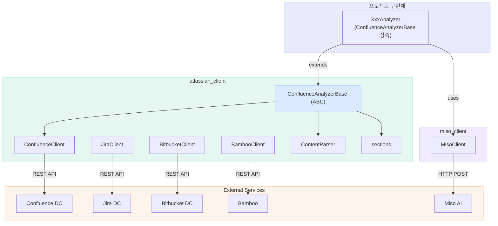
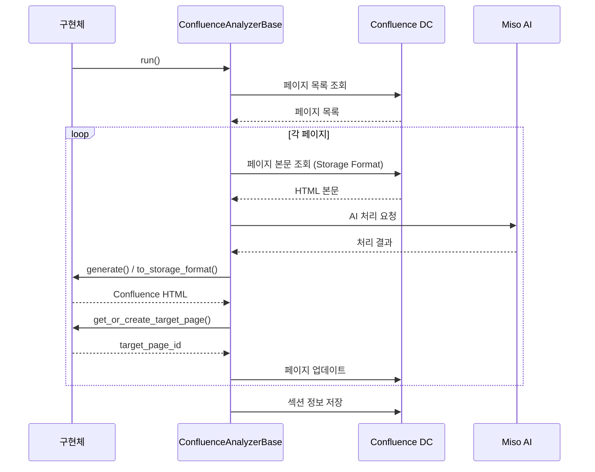

# Atlassian & Miso 클라이언트 아키텍처

> `atlassian_client v0.2.0` · `miso_client v0.1.0` — 2026-05-01 기준

---

## 1. 패키지 구성

### atlassian_client

Atlassian Data Center 제품군 연동 공통 클라이언트. 각 프로젝트는 `ConfluenceAnalyzerBase`를 상속받아 추상 메서드 3개를 구현하는 것만으로 파이프라인을 완성합니다.

| 모듈 | 클래스 / 함수 | 설명 |
|---|---|---|
| `base.py` | `ConfluenceAnalyzerBase` | 파이프라인 추상 클래스 (3 추상메서드 + 4 훅) |
| `confluence.py` | `ConfluenceClient` | Confluence DC REST API 래퍼 |
| `jira.py` | `JiraClient` | Jira DC REST API v2 래퍼 |
| `bitbucket.py` | `BitbucketClient` | Bitbucket Server/DC REST API 1.0 래퍼 |
| `bamboo.py` | `BambooClient` | Bamboo REST API 래퍼 |
| `parser.py` | `ContentParser` | Storage Format HTML → 텍스트 파싱 |
| `sections.py` | `get_sections`, `save_sections` | content property 기반 섹션 CRUD |
| `utils.py` | `split_into_chunks` 외 | 공통 유틸 |
| `cli.py` | `run_main()` | CLI 진입점 |

### miso_client

사내 Miso AI 연동 클라이언트. `atlassian_client`와 독립된 별도 패키지로, 필요한 프로젝트에서 선택적으로 설치합니다.

| 메서드 | 설명 |
|---|---|
| `chat(text)` | 단일 요청 / 응답 |
| `stream_chat(text)` | 스트리밍 응답 |

---

## 2. 컴포넌트 관계도



---

## 3. ConfluenceAnalyzerBase — 파이프라인 구조

`run()` 호출 한 번으로 전체 파이프라인이 실행됩니다. 구현체는 아래 3개의 추상 메서드만 작성하면 됩니다.

| 구분 | 메서드 | 역할 |
|---|---|---|
| **추상 (필수)** | `generate(miso, text)` | AI 처리 결과 생성 |
| **추상 (필수)** | `to_storage_format(result)` | Confluence Storage Format HTML 변환 |
| **추상 (필수)** | `get_or_create_target_page(confluence, year, month)` | 저장 대상 페이지 조회 또는 생성 |
| 훅 (선택) | `before_run()` | 파이프라인 시작 전 처리 |
| 훅 (선택) | `after_run()` | 파이프라인 완료 후 처리 |
| 훅 (선택) | `on_page_start(page)` | 페이지 처리 시작 시 |
| 훅 (선택) | `on_page_end(page, result)` | 페이지 처리 완료 시 |

### 구현 예시

```python
from atlassian_client import ConfluenceAnalyzerBase, run_main

class MyAnalyzer(ConfluenceAnalyzerBase):
    space_key = "SPACE"
    root_page_id = "123456789"
    property_key = "my-sections"
    source_roots = [{"root_id": "aaa", "archive_id": "bbb"}]

    def generate(self, miso, text): ...
    def to_storage_format(self, result): ...
    def get_or_create_target_page(self, confluence, year, month): ...

if __name__ == "__main__":
    run_main(MyAnalyzer)
```

---

## 4. 파이프라인 실행 흐름



---

## 5. 설치

```bash
# atlassian_client 만 사용하는 경우
pip install -e %PLUGINS_PATH%\atlassian_client

# Miso AI 연동이 필요한 경우 추가 설치
pip install -e %PLUGINS_PATH%\miso_client
```

> `PLUGINS_PATH=D:\03.project-hub\plugins` — 시스템 환경변수 또는 `.env` 에 설정

---

## 6. 환경변수

| 서비스 | 환경변수 | 설명 |
|---|---|---|
| Confluence | `CONFLUENCE_URL` | DC 접속 URL |
| Confluence | `CONFLUENCE_API_TOKEN` | Personal Access Token |
| Jira | `JIRA_URL` | DC 접속 URL |
| Jira | `JIRA_USERNAME` | 계정 ID |
| Jira | `JIRA_API_TOKEN` | Personal Access Token |
| Bitbucket | `BITBUCKET_URL` | Server/DC 접속 URL |
| Bitbucket | `BITBUCKET_USERNAME` | 계정 ID |
| Bitbucket | `BITBUCKET_API_TOKEN` | Personal Access Token |
| Bamboo | `BAMBOO_URL` | 접속 URL |
| Bamboo | `BAMBOO_USERNAME` | 계정 ID |
| Bamboo | `BAMBOO_API_TOKEN` | Personal Access Token |
| Miso AI | `MISO_API_URL` | API 엔드포인트 (`/chat` 포함 전체 URL) |
| Miso AI | `MISO_API_KEY` | 앱 비밀키 (`app-xxx` 형식) |
