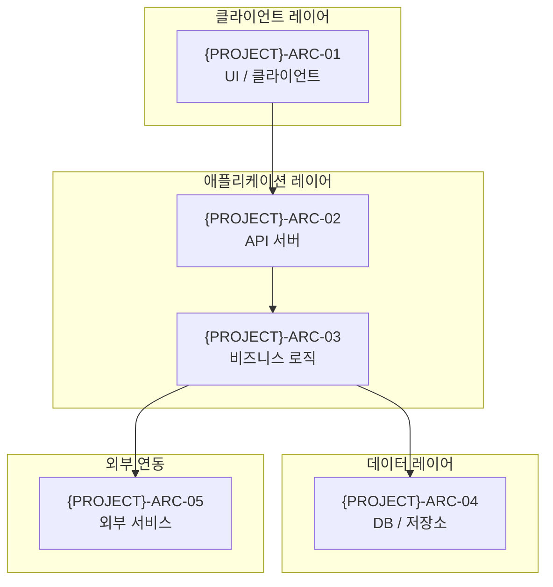
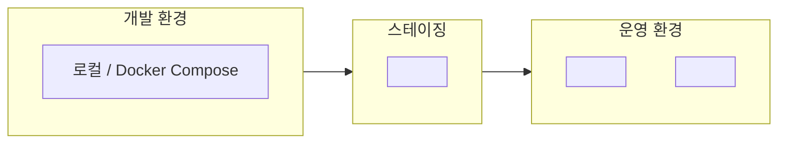
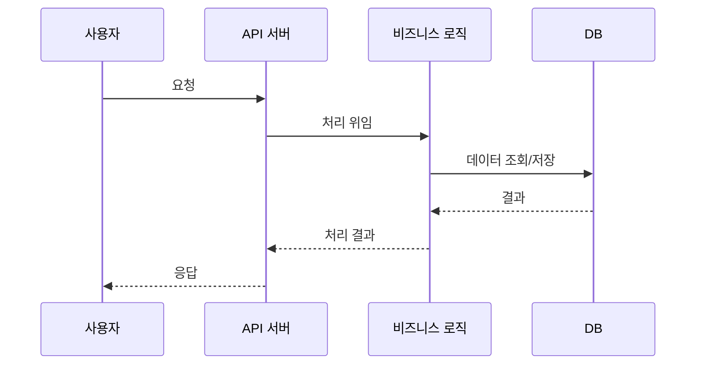

> **문서 ID** `{PROJECT}-ARC-01` · **단계** design · **필수** 필수
> **작성 가이드**: [`ARC-authoring-guide.md`](../../guides/ARC-authoring-guide.md)

---

## §1 개요

### 목적
<!-- 이 시스템의 아키텍처 결정 사항과 설계 근거를 기록 -->

### 아키텍처 원칙
| # | 원칙 | 근거 (REQ 참조) |
|---|------|--------------|
| 1 | <!-- 예: 단일 책임 컴포넌트 분리 --> | `{PROJECT}-REQ-N01` |
| 2 | <!-- 예: 상태 비저장 서비스 계층 --> | `{PROJECT}-REQ-N10` |

---

## §2 논리 아키텍처

### 2.1 컴포넌트 다이어그램

### 2.2 컴포넌트 목록

| 컴포넌트 ID | 이름 | 역할 | 기술 스택 | 의존 컴포넌트 |
|-----------|------|------|---------|-----------|
| `{PROJECT}-ARC-01` | <!-- 컴포넌트명 --> | <!-- 역할 --> | <!-- 기술 --> | — |
| `{PROJECT}-ARC-02` | <!-- 컴포넌트명 --> | <!-- 역할 --> | <!-- 기술 --> | ARC-01 |

---

## §3 배포 아키텍처

### 3.1 배포 다이어그램

### 3.2 배포 노드 목록

| 노드 ID | 노드명 | 환경 | 사양 | 이중화 | 비고 |
|--------|--------|------|------|-------|------|
| `{PROJECT}-ARC-D01` | <!-- 노드명 --> | 개발 / 스테이지 / 운영 | <!-- CPU·메모리 --> | Y / N | |

---

## §4 데이터 흐름

---

## §5 보안 아키텍처

| 레이어 | 보안 메커니즘 | 관련 요구사항 |
|-------|-----------|-----------|
| 전송 계층 | TLS 1.2+ | `{PROJECT}-REQ-N21` |
| 인증 | <!-- 예: JWT / SSO --> | `{PROJECT}-REQ-N20` |
| 인가 | RBAC (ROLE 문서 기준) | `{PROJECT}-ROLE-01` |
| 데이터 저장 | <!-- 암호화 방식 --> | `{PROJECT}-REQ-N21` |

---

## §6 기술 스택

| 카테고리 | 기술 | 버전 | 선택 이유 |
|---------|------|------|---------|
| 언어 | <!-- 예: Python --> | <!-- 3.11+ --> | <!-- 이유 --> |
| 프레임워크 | <!-- 예: FastAPI --> | <!-- 0.115 --> | <!-- 이유 --> |
| DB | <!-- 예: PostgreSQL --> | <!-- 15+ --> | <!-- 이유 --> |
| 배포 | <!-- 예: Docker --> | <!-- 24+ --> | <!-- 이유 --> |

---

## §7 아키텍처 결정 기록 (ADR)

| ADR ID | 결정 사항 | 배경 | 선택한 옵션 | 포기한 옵션 | 영향 |
|--------|---------|------|-----------|-----------|------|
| `{PROJECT}-ADR-01` | <!-- 결정명 --> | <!-- 배경 --> | <!-- 선택 --> | <!-- 포기 --> | <!-- 영향 --> |

---

## 추적성 (Traceability)

| 방향 | 연결 문서 | 관계 설명 |
|------|---------|---------|
| ↑ 상위 | REQ — NFR·제약사항이 아키텍처 결정에 반영 | N:1 |
| ↓ 하위 | DAT — 데이터 레이어 구체화 | 1:1 |
| ↓ 하위 | API — 인터페이스 레이어 구체화 | 1:1 |
| ↓ 하위 | SEC — 보안 뷰 구체화 | 1:1 |
| ↓ 하위 | CFG — 배포 환경·설정 값 구체화 | 1:1 |
| ↓ 하위 | TRC — 추적 매트릭스로 집계 | 자동 |

---

## 검증 체크리스트

- [ ] doc_id 형식: `{PROJECT}-ARC-01` (PREFIX 포함)
- [ ] trace.up에 REQ 문서 ID 등록
- [ ] §2 논리 아키텍처: 컴포넌트 다이어그램 + 목록 작성
- [ ] §3 배포 아키텍처: 환경별(개발·스테이지·운영) 다이어그램 작성
- [ ] §4 데이터 흐름: 시퀀스 다이어그램 작성
- [ ] §5 보안 아키텍처: 4개 레이어(전송·인증·인가·저장) 기재
- [ ] §6 기술 스택: 선택 이유 포함
- [ ] §7 ADR: 주요 결정 사항 1개 이상 기재
- [ ] 모든 ID에 `{PROJECT}-` prefix 적용
