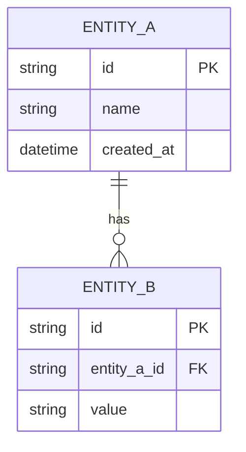

> **문서 ID** `{PROJECT}-DAT-01` · **단계** design · **필수** 조건부 (DB 사용 시)
> **작성 가이드**: [`DAT-authoring-guide.md`](../../guides/DAT-authoring-guide.md)

---

## §1 개요

### 목적
<!-- 이 시스템의 데이터 구조와 영속성 정책을 정의하는 목적 기술 -->

### DB·저장소 목록

| 저장소 ID | 유형 | 제품 | 용도 | ARC 참조 |
|---------|------|------|------|---------|
| `{PROJECT}-DS-01` | RDBMS / NoSQL / 파일 / 캐시 | <!-- 예: PostgreSQL --> | <!-- 주 데이터 저장 --> | `{PROJECT}-ARC-04` |

---

## §2 ERD (Entity-Relationship Diagram)

> 엔티티명은 실제 테이블/컬렉션명을 사용.

---

## §3 엔티티 상세

### `{PROJECT}-DAT-E01` — <!-- 엔티티명 (테이블명) -->

**기본 정보**

| 항목 | 내용 |
|------|------|
| 설명 | <!-- 이 엔티티의 역할 --> |
| 저장소 | `{PROJECT}-DS-01` |
| FUNC 참조 | `{PROJECT}-FUNC-01` |

**필드 정의**

| 필드 ID | 컬럼명 | 타입 | 필수 | 기본값 | 설명 | PII |
|--------|--------|------|------|-------|------|-----|
| `{PROJECT}-DAT-E01-F01` | id | UUID / SERIAL | Y | auto | 기본 키 | — |
| `{PROJECT}-DAT-E01-F02` | <!-- 컬럼명 --> | <!-- 타입 --> | Y / N | <!-- 기본값 --> | <!-- 설명 --> | <!-- Y/N --> |

> **[PII]** PII 필드는 이 셀에 명시 + 암호화·마스킹 정책 기재

**제약 조건**

| 유형 | 대상 컬럼 | 조건 |
|------|---------|------|
| PK | id | — |
| FK | <!-- 컬럼 --> | <!-- 참조 테이블.컬럼 --> |
| UNIQUE | <!-- 컬럼 --> | — |
| CHECK | <!-- 컬럼 --> | <!-- 조건식 --> |

---

## §4 인덱스 전략

| 테이블 | 인덱스명 | 대상 컬럼 | 유형 | 목적 |
|-------|---------|---------|------|------|
| <!-- 테이블명 --> | `idx_{table}_{col}` | <!-- 컬럼 --> | B-TREE / GIN / 등 | <!-- 조회 패턴 --> |

---

## §5 데이터 보존·삭제 정책

| 엔티티 | 보존 기간 | 삭제 방식 | 아카이브 정책 |
|--------|---------|---------|-----------|
| <!-- 엔티티명 --> | <!-- 기간 --> | Hard / Soft delete | <!-- 아카이브 여부 --> |

---

## §6 마이그레이션 정책

| 항목 | 내용 |
|------|------|
| 마이그레이션 도구 | <!-- 예: Alembic, Flyway, 수동 SQL --> |
| 배포 순서 | <!-- 마이그레이션 우선 / 코드 우선 --> |
| 롤백 방법 | <!-- 롤백 스크립트 위치 및 절차 --> |
| 테스트 DB 초기화 | <!-- 테스트 픽스처 전략 --> |

---

## 추적성 (Traceability)

| 방향 | 연결 문서 | 관계 설명 |
|------|---------|---------|
| ↑ 상위 | ARC — 데이터 레이어 아키텍처 구체화 | 1:1 |
| ↑ 상위 | FUNC — 기능이 다루는 데이터 구조 정의 | N:1 |
| ↓ 하위 | UTC — DB 관련 단위 테스트 | 1:N |
| ↓ 하위 | CFG — DB 접속 정보·설정 항목 | 1:1 |
| ↓ 하위 | TRC — 추적 매트릭스로 집계 | 자동 |

---

## 검증 체크리스트

- [ ] doc_id 형식: `{PROJECT}-DAT-01` (PREFIX 포함)
- [ ] trace.up에 ARC·FUNC 문서 ID 등록
- [ ] §2 ERD: 모든 엔티티 간 관계 표현
- [ ] §3 각 엔티티: 필드 타입·필수여부·기본값·PII 여부 기재
- [ ] §3 제약 조건: PK·FK·UNIQUE 기재
- [ ] §4 인덱스: 주요 조회 패턴 기반 인덱스 정의
- [ ] §5 보존·삭제 정책: 모든 엔티티 포함
- [ ] PII 필드 마킹 및 암호화 정책 기재
- [ ] 모든 ID에 `{PROJECT}-` prefix 적용
