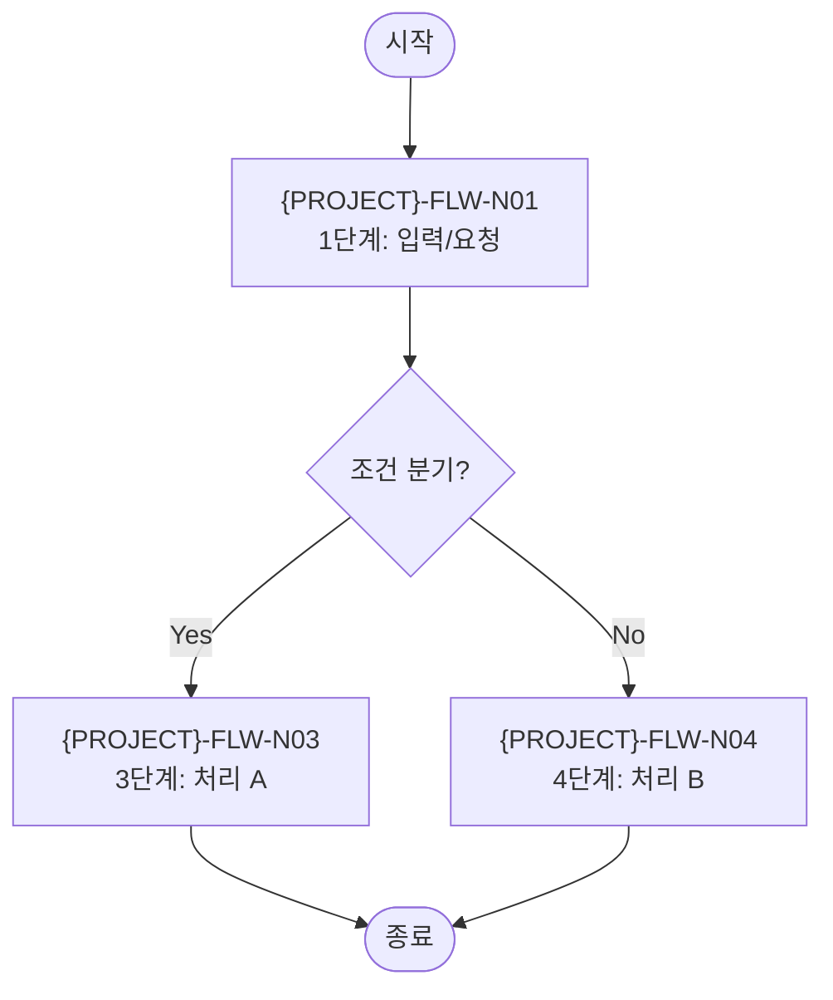

> **문서 ID** `{PROJECT}-FLW-01` · **단계** design · **필수** 필수
> **작성 가이드**: [`FLW-authoring-guide.md`](../../guides/FLW-authoring-guide.md)

---

## §1 개요

### 목적
<!-- 이 흐름도가 다루는 업무 프로세스를 한 문장으로 기술 -->

### 흐름 목록

| 흐름 ID | 흐름명 | 주액터 | 시작 조건 | 종료 조건 |
|--------|--------|-------|---------|---------|
| `{PROJECT}-FLW-01` | <!-- 메인 흐름명 --> | <!-- 주체 역할 --> | <!-- 트리거 이벤트 --> | <!-- 완료 상태 --> |
| `{PROJECT}-FLW-02` | <!-- 예외 흐름명 --> | <!-- 주체 역할 --> | <!-- 예외 조건 --> | <!-- 완료/실패 상태 --> |

---

## §2 액터 정의

| 액터 ID | 역할명 | 설명 | REQ 페르소나 참조 |
|--------|--------|------|----------------|
| `{PROJECT}-ACT-01` | <!-- 역할명 --> | <!-- 역할 설명 --> | `{PROJECT}-PER-01` |
| `{PROJECT}-ACT-02` | <!-- 역할명 --> | <!-- 역할 설명 --> | `{PROJECT}-PER-02` |

> 최소 2개 이상 정의.

---

## §3 메인 흐름 (`{PROJECT}-FLW-01`)

### 3.1 흐름 다이어그램

### 3.2 노드별 상세

| 노드 ID | 단계명 | 액터 | 입력 | 처리 내용 | 출력 | FUNC 참조 |
|--------|--------|------|------|---------|------|---------|
| `{PROJECT}-FLW-N01` | <!-- 단계명 --> | ACT-01 | <!-- 입력 데이터 --> | <!-- 처리 내용 --> | <!-- 출력 데이터 --> | `{PROJECT}-FUNC-01` |
| `{PROJECT}-FLW-N03` | <!-- 단계명 --> | ACT-01 | <!-- 입력 --> | <!-- 처리 --> | <!-- 출력 --> | `{PROJECT}-FUNC-02` |

---

## §4 예외·분기 흐름

| 흐름 ID | 분기 조건 | 발생 위치 (노드) | 처리 내용 | 결과 상태 |
|--------|---------|--------------|---------|---------|
| `{PROJECT}-FLW-E01` | <!-- 예외 발생 조건 --> | FLW-N01 | <!-- 대응 처리 --> | 실패 / 재시도 |

> 최소 1개 이상 정의.

---

## §5 화면 매핑 (조건부 — UI 있는 노드만)

| 노드 ID | 노드명 | SCR ID | 화면명 |
|--------|--------|--------|--------|
| `{PROJECT}-FLW-N01` | <!-- 노드명 --> | `{PROJECT}-SCR-01` | <!-- 화면명 --> |

> UI가 없는 프로젝트(API-only 등)는 본 섹션 전체를 삭제.

---

## 추적성 (Traceability)

| 방향 | 연결 문서 | 관계 설명 |
|------|---------|---------|
| ↑ 상위 | REQ — 각 FR이 흐름 노드로 분해됨 | N:1 |
| ↓ 하위 | FUNC — 각 노드가 기능으로 구현됨 | 1:N |
| ↓ 하위 | SCR — UI 노드가 화면으로 구체화됨 | 조건부 1:1 |
| ↓ 하위 | TRC — 추적 매트릭스로 집계 | 자동 |

---

## 검증 체크리스트

- [ ] doc_id 형식: `{PROJECT}-FLW-01` (PREFIX 포함)
- [ ] trace.up에 REQ 문서 ID 등록
- [ ] §2 액터: 2개 이상 정의, REQ 페르소나 참조
- [ ] §3 다이어그램: 노드·엣지 ID 형식 준수 (`{PROJECT}-FLW-N##`)
- [ ] §3.2 노드 상세: 입력·처리·출력 모두 기재
- [ ] §4 예외 흐름: 1개 이상 기재
- [ ] FUNC 참조 컬럼: 구현 대상 노드 연결
- [ ] 모든 ID에 `{PROJECT}-` prefix 적용
