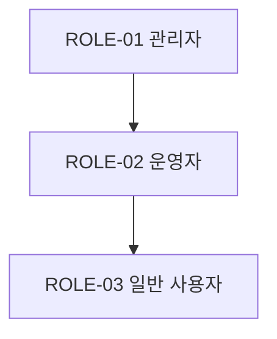

> **문서 ID** `{PROJECT}-ROLE-01` · **단계** design · **필수** 조건부 (인증·다중 사용자)
> **작성 가이드**: [`ROLE-authoring-guide.md`](../../guides/ROLE-authoring-guide.md)

---

## §1 개요

### 목적
<!-- 이 시스템의 역할 체계와 권한 범위를 정의하는 목적 기술 -->

### 역할 목록

| 역할 ID | 역할명 | 설명 | REQ 페르소나 참조 |
|--------|--------|------|----------------|
| `{PROJECT}-ROLE-01` | <!-- 역할명 (예: 관리자) --> | <!-- 역할 설명 --> | `{PROJECT}-PER-01` |
| `{PROJECT}-ROLE-02` | <!-- 역할명 (예: 일반 사용자) --> | <!-- 역할 설명 --> | `{PROJECT}-PER-02` |

---

## §2 역할별 상세 정의

### `{PROJECT}-ROLE-01` — <!-- 역할명 -->

| 항목 | 내용 |
|------|------|
| 역할 설명 | <!-- 이 역할의 책임과 범위 --> |
| 배정 기준 | <!-- 누가 이 역할을 받는가 --> |
| 만료·회수 조건 | <!-- 역할이 제거되는 조건 --> |
| 상위 역할 | <!-- 상속받는 역할 ID / 없으면 없음 --> |

---

## §3 권한 매트릭스

<!-- 행: 기능/리소스, 열: 역할 / 값: C(Create) R(Read) U(Update) D(Delete) E(Execute) - (불가) -->

| 기능·리소스 | FUNC 참조 | ROLE-01 | ROLE-02 | ROLE-03 | 비고 |
|-----------|---------|--------|--------|--------|------|
| <!-- 리소스명 --> | `{PROJECT}-FUNC-01` | CRUD | R | - | <!-- 조건 --> |
| <!-- 리소스명 --> | `{PROJECT}-FUNC-02` | CRUDE | R | - | |

---

## §4 역할 상속 구조 (해당 시)

> 상속 없는 경우 본 섹션 삭제.

---

## §5 특수 권한 및 예외 정책

| 케이스 | 대상 역할 | 권한 내용 | 승인 조건 | 만료 조건 |
|-------|---------|---------|---------|---------|
| <!-- 예외 케이스 --> | ROLE-01 | <!-- 특수 권한 --> | <!-- 승인 방식 --> | <!-- 만료 시점 --> |

---

## §6 역할 변경 이력 관리

<!-- 역할·권한 변경 시 감사 로그 정책 기술 -->
- 변경 주체, 변경 시각, 변경 내용을 로그로 기록
- 보존 기간: <!-- 예: 1년 -->

---

## 추적성 (Traceability)

| 방향 | 연결 문서 | 관계 설명 |
|------|---------|---------|
| ↑ 상위 | REQ — 권한 관련 FR·NFR에서 역할 파생 | N:1 |
| ↓ 하위 | FUNC — 각 기능의 접근 제어에 역할 매핑 | 1:N |
| ↓ 하위 | SEC — 인가 정책 설계의 기반 | 1:1 |
| ↓ 하위 | TRC — 추적 매트릭스로 집계 | 자동 |

---

## 검증 체크리스트

- [ ] doc_id 형식: `{PROJECT}-ROLE-01` (PREFIX 포함)
- [ ] trace.up에 REQ 문서 ID 등록
- [ ] §1 역할 목록: REQ 페르소나와 매핑 완료
- [ ] §3 권한 매트릭스: FUNC 참조 컬럼 기재
- [ ] §3 권한 매트릭스: 모든 주요 기능·리소스 포함
- [ ] §5 예외 정책: 특수 권한 케이스 기재
- [ ] §6 변경 이력 관리 정책 기재
- [ ] 모든 ID에 `{PROJECT}-` prefix 적용
