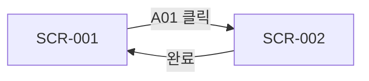

> **문서 ID** `{PROJECT}-SCR-01` · **단계** design · **필수** 조건부 (UI 보유 시)
> **작성 가이드**: [`SCR-authoring-guide.md`](../../guides/SCR-authoring-guide.md)

---

## §1 개요

### 목적
<!-- 이 화면정의서가 다루는 UI 범위를 한 문장으로 기술 -->

### 화면 목록

| 화면 ID | 화면명 | URL / 라우트 | 주액터 | FLW 참조 | 필수 여부 |
|--------|--------|------------|-------|---------|---------|
| `{PROJECT}-SCR-001` | <!-- 화면명 --> | <!-- /path --> | <!-- 역할 --> | FLW-N01 | 필수 |
| `{PROJECT}-SCR-002` | <!-- 화면명 --> | <!-- /path --> | <!-- 역할 --> | FLW-N03 | 조건부 |

---

## §2 공통 UI 규칙

### 2.1 레이아웃 구조
<!-- 공통 헤더·사이드바·푸터 등 레이아웃 패턴 기술 -->

### 2.2 공통 컴포넌트

| 컴포넌트 ID | 컴포넌트명 | 설명 | 사용 화면 |
|-----------|---------|------|---------|
| `{PROJECT}-CMP-01` | <!-- 컴포넌트명 --> | <!-- 역할 설명 --> | SCR-001, SCR-002 |

### 2.3 공통 에러 표시 규칙
- <!-- 에러 표시 위치 및 방식 서술 -->

---

## §3 화면별 상세

### `{PROJECT}-SCR-001` — <!-- 화면명 -->

**개요**
- 목적: <!-- 이 화면의 목적 -->
- 접근 조건: <!-- 권한·상태 조건 -->
- FLW 참조: `{PROJECT}-FLW-N01`

**3.1 레이아웃 스케치 (ASCII)**
```
+--[헤더: 제목 + 액션버튼]--+
| [필드 영역]                |
| [버튼 그룹]                |
+--[푸터: 페이지네이션]------+
```

**3.2 필드 목록**

| 필드 ID | 라벨 | 입력 타입 | 필수 | 유효성 규칙 | 기본값 | 비고 |
|--------|------|---------|------|-----------|-------|------|
| `{PROJECT}-SCR-001-F01` | <!-- 라벨명 --> | text / select / date / … | Y / N | <!-- 규칙 --> | — | |

**3.3 액션 정의**

| 액션 ID | 버튼·트리거 | 동작 설명 | 이동 화면 / API |
|--------|----------|---------|--------------|
| `{PROJECT}-SCR-001-A01` | <!-- 버튼명 --> | <!-- 동작 --> | `{PROJECT}-SCR-002` / `{PROJECT}-API-01` |

**3.4 에러·유효성 처리**

| 조건 | 메시지 | 표시 위치 |
|------|-------|---------|
| <!-- 에러 조건 --> | <!-- 에러 메시지 --> | <!-- 필드 하단 / 상단 알림 --> |

---

### `{PROJECT}-SCR-002` — <!-- 화면명 -->

<!-- §3 패턴 반복 -->

---

## §4 화면 전환 흐름



---

## 추적성 (Traceability)

| 방향 | 연결 문서 | 관계 설명 |
|------|---------|---------|
| ↑ 상위 | REQ — FR에서 화면 요구사항 파생 | N:1 |
| ↑ 상위 | FLW — 흐름 노드에서 화면 구체화 | 1:1 |
| ↓ 하위 | UTC — UI 동작·필드 단위 테스트 | 1:N |
| ↓ 하위 | USM — 사용자 매뉴얼 화면 설명 | 조건부 |
| ↓ 하위 | TRC — 추적 매트릭스로 집계 | 자동 |

---

## 검증 체크리스트

- [ ] doc_id 형식: `{PROJECT}-SCR-01` (PREFIX 포함)
- [ ] trace.up에 REQ·FLW 문서 ID 등록
- [ ] §1 화면 목록: 모든 UI 화면 등재
- [ ] §3 각 화면: 레이아웃·필드·액션·에러처리 4항목 기재
- [ ] 필드 ID 형식: `{PROJECT}-SCR-###-F##`
- [ ] 필수 필드 표시 및 유효성 규칙 기재
- [ ] §4 화면 전환 흐름 다이어그램 작성
- [ ] 모든 ID에 `{PROJECT}-` prefix 적용
