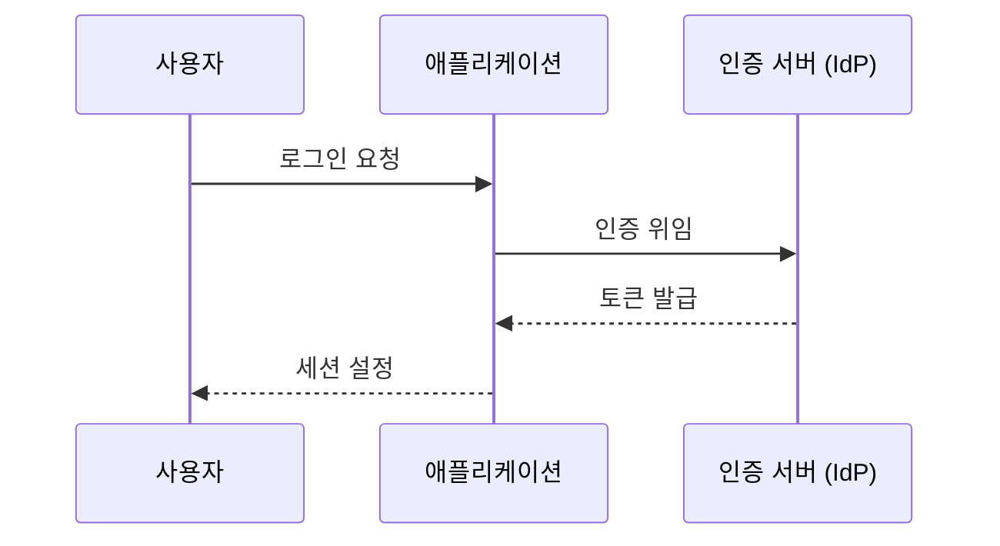

> **문서 ID** `{PROJECT}-SEC-01` · **단계** design · **필수** 조건부 (개인정보·인증·외부키)
> **작성 가이드**: [`SEC-authoring-guide.md`](../../guides/SEC-authoring-guide.md)

---

## §1 개요

### 목적
<!-- 이 시스템의 보안 위협을 식별하고 대응 설계를 정의하는 목적 기술 -->

### 보안 범위

| 항목 | 포함 여부 | 비고 |
|------|---------|------|
| 개인정보 처리 | Y / N | <!-- 개인정보 유형 --> |
| 외부 인증 (SSO/OAuth) | Y / N | <!-- 방식 --> |
| 외부 API Key 보유 | Y / N | <!-- 대상 서비스 --> |
| 암호화 데이터 저장 | Y / N | <!-- 대상 필드 --> |

---

## §2 위협 모델 (STRIDE)

| 위협 ID | STRIDE 유형 | 위협 설명 | 공격 벡터 | 영향도 | 발생 가능성 | 위험 등급 |
|--------|-----------|---------|---------|-------|-----------|---------|
| `{PROJECT}-SEC-T01` | Spoofing | <!-- 위협 설명 --> | <!-- 경로 --> | 높음 / 보통 / 낮음 | 높음 / 보통 / 낮음 | Critical / High / Medium / Low |
| `{PROJECT}-SEC-T02` | Tampering | <!-- 위협 설명 --> | <!-- 경로 --> | | | |
| `{PROJECT}-SEC-T03` | Info Disclosure | <!-- 위협 설명 --> | <!-- 경로 --> | | | |

> STRIDE: Spoofing(인증 위조), Tampering(데이터 변조), Repudiation(부인), Information Disclosure(정보 노출), DoS(가용성 훼손), Elevation of Privilege(권한 상승)

---

## §3 보안 요구사항 대응

| 대응책 ID | 대응 위협 | 대응 방법 | 구현 위치 | 검증 방법 |
|---------|---------|---------|---------|---------|
| `{PROJECT}-SEC-R01` | `{PROJECT}-SEC-T01` | <!-- 대응 방법 --> | <!-- 코드·설정 위치 --> | <!-- 테스트 방법 --> |

---

## §4 인증·인가 설계

### 4.1 인증 흐름

### 4.2 토큰·세션 정책

| 항목 | 정책 | 근거 |
|------|------|------|
| 토큰 유효 시간 | <!-- 예: Access 1h, Refresh 7d --> | <!-- 보안 요구사항 --> |
| 저장 위치 | <!-- 예: HttpOnly Cookie --> | XSS 방어 |
| 재발급 조건 | <!-- 예: Refresh 토큰 유효 시 --> | |
| 폐기 방법 | <!-- 예: 블랙리스트 또는 단기 TTL --> | |

---

## §5 데이터 보호

### 5.1 개인정보 처리 목록

> **[PII]** 아래 데이터는 개인정보 — 마스킹·암호화 정책 적용 필수

| 데이터 항목 | 저장 위치 | 암호화 방식 | 마스킹 규칙 | 보존 기간 |
|-----------|---------|-----------|-----------|---------|
| <!-- 개인정보 항목 --> | DAT-E01 | AES-256 | <!-- 마스킹 패턴 --> | <!-- 기간 --> |

### 5.2 시크릿 관리

| 시크릿 유형 | 저장 방식 | 접근 권한 | 로테이션 주기 |
|-----------|---------|---------|-----------|
| <!-- 예: API Key --> | keyring / vault | <!-- 최소 권한 원칙 --> | <!-- 주기 --> |

> 시크릿 값은 이 문서에 절대 기재하지 않는다. `platform/setup/secrets_guide.md` 참조.

---

## §6 감사·로깅

| 이벤트 | 로그 레벨 | 포함 필드 | 보존 기간 | 알림 조건 |
|-------|---------|---------|---------|---------|
| 로그인 성공/실패 | INFO / WARN | user_id, ip, timestamp | 1년 | 5회 연속 실패 시 |
| 권한 거부 | WARN | user_id, resource, action | 1년 | — |
| 데이터 접근 (PII) | INFO | user_id, record_id | 1년 | — |
| 시크릿 접근 | WARN | requester, secret_name | 1년 | 즉시 알림 |

---

## 추적성 (Traceability)

| 방향 | 연결 문서 | 관계 설명 |
|------|---------|---------|
| ↑ 상위 | ARC — 보안 아키텍처 뷰 구체화 | 1:1 |
| ↑ 상위 | ROLE — 인가 정책 설계 기반 | 1:1 |
| ↑ 상위 | REQ — NFR 보안 요구사항 반영 | N:1 |
| ↓ 하위 | CFG — 보안 설정 값 (키·정책) | 1:1 |
| ↓ 하위 | UTC — 인증·인가 단위 테스트 | 1:N |
| ↓ 하위 | TRC — 추적 매트릭스로 집계 | 자동 |

---

## 검증 체크리스트

- [ ] doc_id 형식: `{PROJECT}-SEC-01` (PREFIX 포함)
- [ ] trace.up에 ARC·ROLE·REQ 문서 ID 등록
- [ ] §2 위협 모델: STRIDE 6개 유형 검토 완료
- [ ] §3 대응책: 모든 High·Critical 위협에 대응책 기재
- [ ] §4 인증 흐름: 시퀀스 다이어그램 작성
- [ ] §5 PII 목록: 개인정보 항목 모두 등재 및 암호화 정책 기재
- [ ] §5 시크릿: 저장 방식·접근 권한·로테이션 기재
- [ ] 시크릿 값 본문 미노출 확인
- [ ] §6 감사 로그: 보안 이벤트 목록 완성
- [ ] 모든 ID에 `{PROJECT}-` prefix 적용
