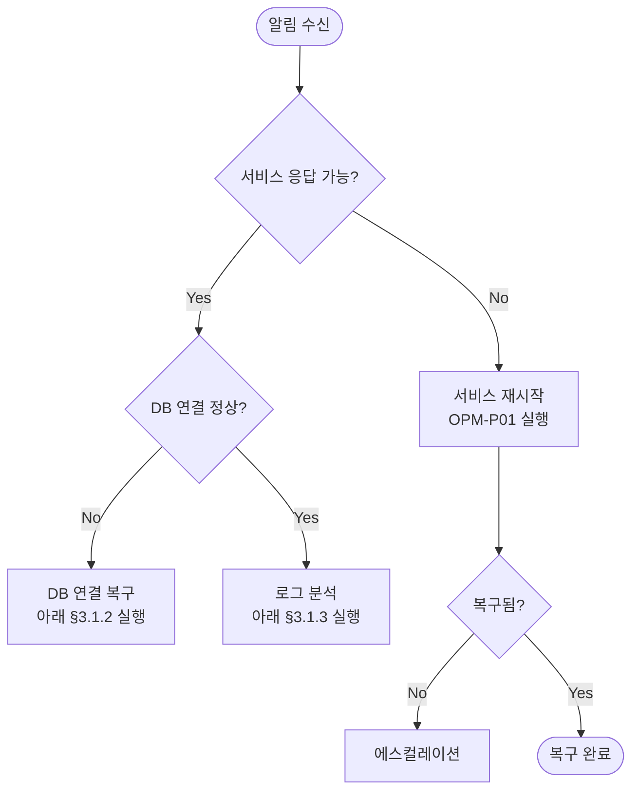

> **문서 ID** `{PROJECT}-RUN-01` · **단계** deploy · **필수** 필수
> **작성 가이드**: [`RUN-authoring-guide.md`](../../guides/RUN-authoring-guide.md)

---

## §1 개요

### 목적
<!-- 인시던트 발생 시 즉각 실행 가능한 단계별 대응 플레이북 제공 목적 기술 -->

### 플레이북 목록

| 플레이북 ID | 플레이북명 | 트리거 | 예상 복구 시간 | OPM 참조 |
|-----------|---------|-------|------------|---------|
| `{PROJECT}-RUN-P01` | <!-- 플레이북명 --> | <!-- 트리거 조건 --> | <!-- 예: 30분 이내 --> | `{PROJECT}-OPM-I01` |
| `{PROJECT}-RUN-P02` | <!-- 플레이북명 --> | <!-- 트리거 조건 --> | <!-- 예: 1시간 이내 --> | `{PROJECT}-OPM-I02` |

---

## §2 공통 진단 도구

```bash
# 서비스 상태 확인
<!-- 상태 확인 명령어 -->

# 최근 에러 로그
<!-- 로그 조회 명령어 (최근 100줄) -->

# 프로세스 리소스 사용량
<!-- CPU/메모리 확인 명령어 -->

# DB 연결 테스트
<!-- DB 연결 확인 명령어 -->

# 외부 서비스 연결 테스트
<!-- curl 또는 ping 명령어 -->
```

---

## §3 플레이북 상세

### `{PROJECT}-RUN-P01` — <!-- 플레이북명 -->

**기본 정보**

| 항목 | 내용 |
|------|------|
| 트리거 | <!-- 어떤 알림/상황에서 이 플레이북을 실행하는가 --> |
| 영향 | <!-- 영향받는 기능·사용자 --> |
| SLO | 복구 목표: <!-- 예: 30분 이내 --> |
| 담당자 | <!-- On-call 담당 --> |

**의사결정 트리**



**복구 절차**

**[1단계] 즉시 확인 (5분 이내)**
```bash
# 알림 내용 확인 후 즉시 실행
<!-- 진단 명령어 1 -->
<!-- 진단 명령어 2 -->
```

**[2단계] 1차 조치 (15분 이내)**
```bash
# 원인에 따라 선택 실행

# 케이스 A: <!-- 원인 A -->
<!-- 조치 명령어 -->

# 케이스 B: <!-- 원인 B -->
<!-- 조치 명령어 -->
```

**[3단계] 복구 확인**
```bash
# 서비스 정상 동작 확인
<!-- 헬스체크 명령어 -->

# 에러율 정상화 확인
<!-- 지표 확인 명령어 -->
```

**복구 완료 기준**
- [ ] 서비스 응답 정상 (HTTP 200)
- [ ] 에러율 1% 미만
- [ ] <!-- 추가 기준 -->

---

### `{PROJECT}-RUN-P02` — <!-- 플레이북명 -->

<!-- §3 패턴 반복 -->

---

## §4 에스컬레이션 경로

| 단계 | 시간 기준 | 연락 대상 | 연락 방법 |
|------|---------|---------|---------|
| L1 | 즉시 | On-call 엔지니어 | 슬랙 `<!-- 채널 -->` |
| L2 | 30분 내 미해결 | 팀장 | 슬랙 DM + 전화 |
| L3 | 1시간 내 미해결 | <!-- 임원/CTO --> | 전화 |

---

## §5 사후 처리 (Postmortem)

### 5.1 인시던트 기록 템플릿

```markdown
## 인시던트 요약
- **발생 시각**: 
- **복구 시각**: 
- **총 영향 시간**: 
- **영향 범위**: 

## 근본 원인 (RCA)


## 타임라인


## 조치 내역


## 재발 방지 계획
| # | 조치 항목 | 담당 | 기한 |
|---|---------|------|------|
```

---

## §6 참조 연결

| 유형 | 제목 | 위치 |
|------|------|------|
| 운영 매뉴얼 | `{PROJECT}-OPM-01` | [OPM_운영자매뉴얼.md](OPM_운영자매뉴얼.md) |
| 설정 가이드 | `{PROJECT}-CFG-01` | [CFG_설정가이드.md](CFG_설정가이드.md) |
| 모니터링 대시보드 | — | <!-- URL --> |
| 슬랙 On-call 채널 | — | <!-- 채널명 --> |

---

## 추적성 (Traceability)

| 방향 | 연결 문서 | 관계 설명 |
|------|---------|---------|
| ↑ 상위 | OPM — 운영 매뉴얼의 인시던트 항목을 플레이북으로 세분화 | 1:N |
| ↑ 상위 | CFG — 설정 변경 절차 참조 | 1:1 |
| ↓ 하위 | TRC — 추적 매트릭스로 집계 | 자동 |

---

## 검증 체크리스트

- [ ] doc_id 형식: `{PROJECT}-RUN-01` (PREFIX 포함)
- [ ] trace.up에 OPM·CFG 문서 ID 등록
- [ ] §2 공통 진단 도구: 복사 가능한 명령어 기재
- [ ] §3 플레이북: 1개 이상, 의사결정 트리 포함
- [ ] §3 각 플레이북: 3단계 절차 (확인→조치→검증) 기재
- [ ] §3 복구 완료 기준: 체크리스트 기재
- [ ] §4 에스컬레이션: L1~L3 경로 기재
- [ ] §5 Postmortem 템플릿 포함
- [ ] §6 참조 연결: OPM·CFG·모니터링 링크 기재
- [ ] 모든 ID에 `{PROJECT}-` prefix 적용
